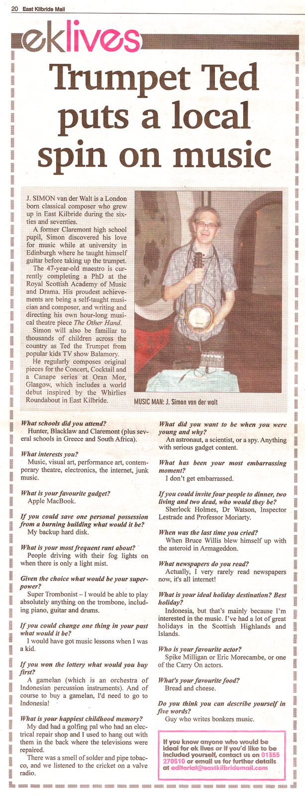

The performance of The Whirlies the other night was a bit of a stunning success. Good audience, including the arts editor of the Herald, Keith Bruce, who seemed to really get the piece;

> 'The new music came from J Simon van der Walt, whose The Whirlies pitted his own prepared multiphonic scrabbling with table-top banjo ukulele and electronic gizmos against lush concert-orchestra strings - a collision only enhanced by the shattering of a glass behind the bar.
> 
> There was some theatre, too, in his intensity and the swaying of the cellists, in as perfect a musical encapsulation of the East Kilbride road system as I ever expect to hear.'

The East Kilbride Mail also wrote up the piece enthusiastically, and even did one of those celebrity twenty question interviews;

]

]

