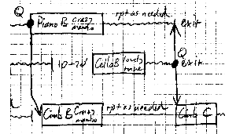

## 22/5/06 for flute, violin, cello, piano, cimbalom and ghettoblaster

### About

Written for and first performed by [Psappha](http://psappha.com) 22/6/06 at the RSAMD in Glasgow. A site-specific in some ways, with the flutist and violinist enterning down the stairs of the academy concert hall, through the audience, with their music carried for them by two of the other players.

The programme note below is of course is an example of the extreme importance of lying to the audience, although one person at least was completely taken in by the reference to Mozart. (There is in fact a heavily disguised quotation of a phrase from Bach.) The 'calm and distant Apotheosis' mentioned in the program note comes when the final player leaves the stage, switching the ghettoblaster on as he does so; we hear a munged text-to-speech version of the programme note above, followed by the composer clearing his throat and saying 'The End'. Oh, and also includes an offstage rendition of one of the [Five Inanities for brass 5tet](inane), 'Jagdmazurka'.

Duration 4'33

### Composer's note

This work is a summing up of the artist’s entire life, from birth, to death, and beyond; in truth, it encompasses all possible lives of all composers in all universes. The opening procession represents Birth, complete with a reminiscence of Mozart heard in the womb. The middle section depicts the struggles of Life. A calm and distant Apotheosis concludes the work.

(Electronic material generated with the aid of a Talking Glitch Machine.)

### Score

An example of piece where a 'score' – in the sense of a linear presentation of all the events vertically aligned in time – would be more work to produce than it would be worth. The diagram extract above shows some of the material from which the piece may be constructed.

