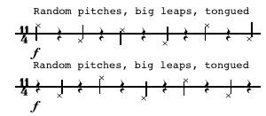

## 27/1/06 a duet for trumpet, bass trumpet and reverb

### About

This was part of an unusual commission from trumpet player Mark O'Keeffe, 'Les Six de Trompette'. The idea was that six of the postrgrad composers at the RSAMD would all write one movement of a work for trumpet and ensemble, starting with solo trumpet, a duet, trio, and so forth up to a larger ensemble. The six composers were, in order of size :) Oliver Searle, myself, Gareth Williams, John De Simone and Alastair Spratt. The piece was performed at the RSAMD on 23/5/06.

I chose to do something very simple, heavily influenced by two world music recordings in my possession; a recording of the Canadian Inuit katajjaq throat music/game (CD Les Voix du Monde Les Chants du Monde 1999 CD 1 track 12) and sacred flute music from New Guinea (CD windim mambu - madang volume 2 Rounder Records, Track 1 Bak, Borai.)

And, I was pleased to be able to work again with my old friend and colleague [John Kenny](http://www.carnyxscotland.co.uk), who suggested using the bass trumpet in the piece.

Duration ~3'

### Composer's note

(There isn’t one.)

### Recording

<audio controls>
  <source src="/the-cave-of-destiny.mp3"/>
</audio>

### Score

[The Cave of Destiny (.pdf 94.8 KB)](../../static/img/the-cave-of-destiny.pdf)

