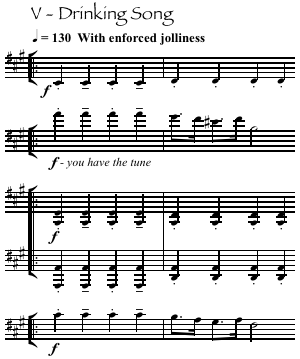

## 10/6/06 pour flûte (et piccolo), trombone, piano, violoncello, glockenspiel et vibraphone

### Recording

<audio controls>
  <source src="/diverses.mp3"/>
</audio>

### (Not the) Composer's note

(This was commissioned by Symposia and performed by them as part of Glasgow University's Musica Nova festival on 10/6/2006. At the time I struggled to write a programme note, and I'm still a little reluctant to do so. Essentially a rather sad, personal piece concerning the split personality of the contemporary composer. On the one hand, the need to be seen as a *proper* modern composer; an original musical language for every piece, new thinking everywhere, if the audience feel bored and confused they should educate themselves. On the other hand, Tunes You Love To Sing; all those bits of music which get left off the list of works, marches, waltzes, jazz riffs, classroom games, theatre pieces…)

### Score

[diverses.pdf (725 KB)](../../static/img/diverses.pdf)

### About

Quite a bit of self-quotation in this piece; opens with a cue I wrote for [Thor's Magic Hammer](thor) (Ginnungagap), extensively re-visits and re-composes my own early march for wind band [Soutra Aisle](soutra), and makes use of material from two of the 'Openings', [Steadily-Stop!](steadily) (in a fun C major version!) and 'Drinking Song' from the [Five Inanities for brass 5tet](inane).

Duration ~20'
