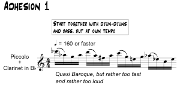

## 9/11/05 for flute, clarinet, electric bass and djun-djuns (African drums)

### About

This was written for the Research Students Conference of the Royal Music Association at Leeds University in January 2006, and first performed there on 6/1/06 by the ensemble [FOCAM](http://www.focam.co.uk/). This conference was notable for two other things; I gave a presentation on [The Cave of Destiny](cave) as part of a session on 'collaborative projects', and, perhaps more significantly, a very interesting keynote speech by the film composer [Adrian Sutton](http://www.adriansutton.com) which really got me thinking about composition as a service rather than a product.

Duration ~5'00

### Composer's note

The given ensemble seems to be two pairs of instruments; the flute and clarinet ‘classical’, the percussion and bass world/jazz/rock. So, force the latter into the classical mold, or vice versa?

Neither; worlds collide. The djun-djun shapes the piece, a polyrhythmic pattern inside a puzzle of variations. The bass line is strung between ‘cadential’ pillars in the djun-djun part.

The winds have distorted classical gestures, further munged by having the transposing clarinet share a part with the concert pitch flute. A metanarrative (‘The History of Classical Music’) is distrusted (√), with obscured quotations (√) from the repertoire.

### Midi demo

<audio controls>
  <source src="/joined_demo.mp3"/>
</audio>

### Score

No 'score' of this piece exists, in the sense of a linear, vertically co-ordinated presentation of musical events in time. The ‘score’, in the sense of ‘the material originated by the composer from which a performance is to be constructed’, consists of some performance notes, an ‘overview’ (which doubles as a performance part for the djun-djuns and bass), and four ‘adhesions’ which comprise the performance material for the winds: [joined_at_the_hip.pdf](../../static/img/joined_at_the_hip.pdf).

