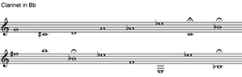

## 16/12/11 for clarinet and acoustic laptop

### Composer's note

_Dr Mueller? Dr Mueller!? Oh, boy :(_ is a postlude to Spiricom, the third piece in Gordon McPherson’s 2007 trilogy Ghosts. The ‘spiricom’ was a psuedoscientific electronic device built by a couple of cranks in the 1980s, who convinced themselves that with it they could hear and talk to dead people including, supposedly, a certain ‘Dr Mueller’.

While the tone of my remarks may betray a certain skepticism towards the notions underlying the work, Gordon’s music strikes me as interesting, challenging, and even entertaining. My ‘postlude’, on the other hand, may prove less rewarding to listen to. It may useful to know that the lack of amplification for the laptop sounds, and the resultant borderline audibility, is deliberate: and that the clarinet line is based on pitch material transcribed by ear from the original work.

### Notes

First performance by Fraser Langton at the Plug festival, Glasgow, 23/4/12.

Duration ~4'33

### Recording

<iframe width="100%" height="125" scrolling="no" frameborder="no" allow="autoplay" src="https://w.soundcloud.com/player/?url=https%3A//api.soundcloud.com/tracks/53031902&color=%23ff5500&auto_play=false&hide_related=true&show_comments=true&show_user=true&show_reposts=false&show_teaser=true&visual=true"></iframe>

### Review

“We now expect something totally weird, wonderful and phantasmagoric from the unique J Simon van der Walt, and there it was in the blinding piece he produced for clarinet and acoustic laptop (but what’s an acoustic laptop?) where single notes from clarinettist Fraser Langton triggered an entire aviary (or tropical jungle) of digitalised choral magic.”

Michael Tumelty, The Herald 25/4/12

### Score

[dr-mueller.pdf](../../static/img/dr-mueller.pdf)

