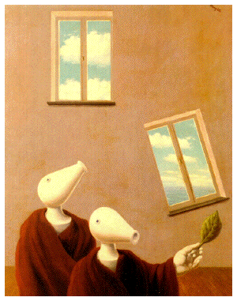

## 2/3/03 for vibraphone, viola, contrabass and CD

### Composer's note

‘Les Rencontres Naturelles’ was inspired in large part by this postcard I received depicting the painting of that name by René Magritte, and the witty caption which accompanied it: _'Oh no! The window is sliding down the wall again! Quick, wave the green leaf!'_.

The electroacoustically treated text is by the French painter and physicist Jacques Mandelbrojt, and concerns the relationships between art, science and mathematics in an era dominated by new technology;

> #### Les rencontres naturelles entre l'art, les sciences et les mathématiques
> 
> L'art et la science peuvent se situer de diverses façons l'un par rapport à l'autre. Il peut y avoir l'indifférence, et pourquoi pas? L'art c'est l'art et la science c'est la science! Mais il y a aussi de nombreuses interactions possible.
> 
> La façon la plus immédiate pour l'art et la science d'interagir, celle qui vient tout de suite à l'esprit, c'est l'utilisation par les artistes de nouvelles technologies scientifiques, de l'ordinateur, du laser. Il est peut-être temps après 30 ou 40 ans d'existence de cet art technologique de tenter d'examiner son statut esthétique; j'effleurerai ce problème.

### Background

Written for a 'Whatever Happened to Music' concert by [Paragon](http://www.paragon-ensemble.com/) on 7 April 2003; **Lev Atlas** viola, **Ninian Perry** double bass **John Poulter** percussion, **Pete Dowling** sound, **John Harris** conductor.

Composed at the Banff Centre 23/2/03-2/3/03.

Duration ~4 mins

### Score, sounds

Here's the full score, and also a copy of the electroacoustic bit which happens half way through;

[Les Rencontres Score (2.9 MB)](/lesrencontresscore.pdf)

<audio controls>
  <source src="/lesrencontresaudio.mp3"/>
</audio>
[LesRencontresAudio.mp3](/lesrencontresaudio.mp3) (1'01, 1.3 MB)

