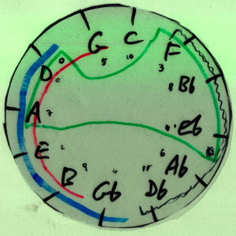

## 14/04/08 for strings and speaking voice

Rotating calculator, made from plastic sheets, used to calculate segments of the cycle of fourths employed in the work.

### Composer's note

Suppose somebody had travelled back in time and accidentally stood on a semiquaver written by one of the Immortal Greats; might the whole future evolution of music have been different?

### Notes

Commissioned and first performed by **Scottish Philharmonic Orchestra**, Dir Gordon Rigby, Cond Peter Cynfryn Jones, Òran Mór Glasgow 14/3/2008, with the speaking part being taken by composer and percussionist [Steve Forman](http://www.tambourine.net/).

A tangent to, or a study towards, [The Other Other Hand](tooh), both works betraying a fascination with the slightly worrying strands of 'social Darwinism' apparent in C Hubert H Parry's 1909 'The Evolution of the Art of Music', and the worry that many of these supremacist notions perhaps still inform our understanding of so-called 'classical' music.

Duration ~10'
