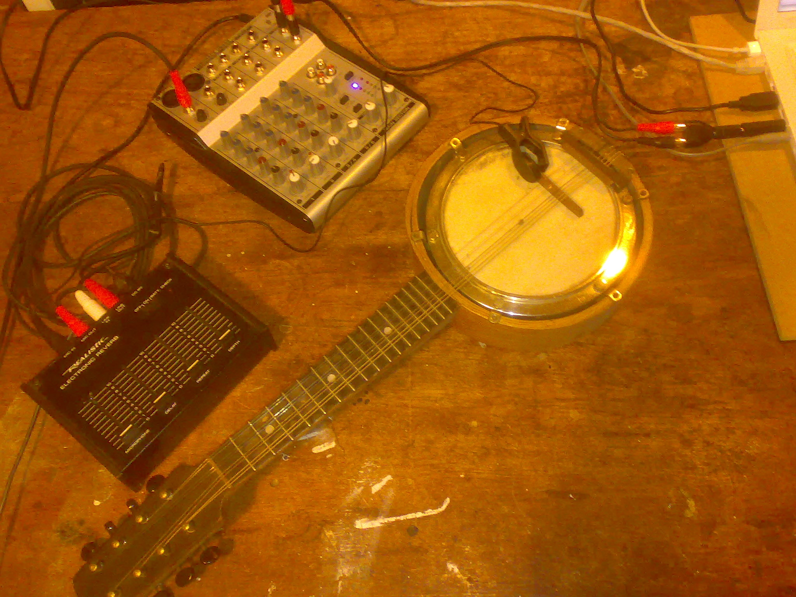

## 17/11/08 for strings and electro-junk improviser

<iframe class="youtube-video" src="https://archive.org/embed/The_Whirlies" frameborder="0" webkitAllowFullScreen="true" mozAllowFullScreen="true" allowFullScreen></iframe>

### Composer's note

What is East Kilbride famous for? I'm not entirely sure how most people would answer that question! For myself, although I'm not exactly Scottish born and bred, there is a big chunk of me which is 'from' East Kilbride; I spent two highly formative periods of my life there, during my primary school years, and again for the last couple of years of high school before university. And one of the things which always sticks in my head about East Kilbride is… roundabouts! Being one of those 60's new towns, it has an elaborate road plan, with sweeping dual carriageways carefully separated from winding dead-end closes; the kind of town where you can see the house you're trying to get to, but there seems to be no way of actually getting there…

The biggest roundabout in East Kilbride is known to most residents by name; 'The Whirlies'. In recent times it's been rather travestied by the addition of traffic lights, but in it's heyday it was a madness of a junction, roads spiralling off in every direction…

Of course, a piece of music can't really be about a roundabout. More than that, this is a reminiscence of my teenage years, when I first started to become seriously interested in music. There were two strands to this. Firstly, I was starting to branch out from my Father's transcendental but admittedly rather limited listening diet of Bach, Wagner, and, er nothing else, to explore the delights of jazz, experimental rock music, Stravinsky, and Bartók. My second way into music was through the soldering iron, literally getting my fingers burnt hacking together home-made noisemakers using transistors salvaged from broken hi-fi sets and the like.

The piece also forms a trailer of sorts for a forthcoming project provisionally entitled The Ted Edwards Electr-O-Matic Orchestra, or something like that.

### Audio

<audio controls>
  <source src="/catalog/whirlies-d-ex.mp3"/>
</audio>

[whirlies-d-ex.mp3](pathname:///catalog/whirlies-d-ex.mp3)\
(0'30 extract, midi strings, real electro-junk)

### Reviews

Reviews of the piece on the [blog](/blog/2008/11/20/the-whirlies-success).

### Notes

Commissioned by the Scottish Philharmonic Orchestra and first performed by them on 17/11/2008 at Òran Mór in Glasgow, with conductor Peter Cynfryn Jones and artistic director: Gordon Rigby. The improvised part was taken by the composer, using an amplifed banjo ukulele originally belonging to his grandfather, through a circuit-bent effects unit.

Duration ~10'
