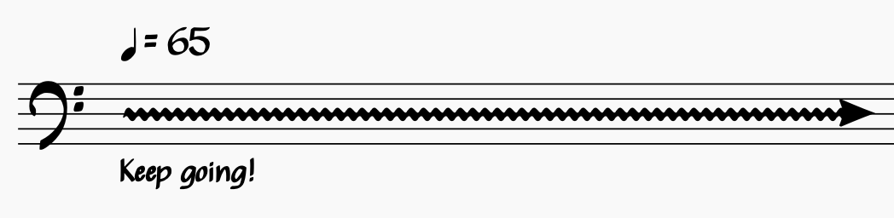

# Simon @ 65

In May of this year I'm going to be 65 years old! There are four performances coming up to celebrate  some of the music I've created:

## (Two Minds Three)

A post-minimalist piece I wrote over 30 years ago, updated and rescored for and ensemble of two accordions, piano, five clarinets, trumpet and percussion.

* Wednesday 18 March 1500-1600
* [RCS Piano Festival: Accordion Showcase](https://www.rcs.ac.uk/whats-on/piano-festival-accordion-showcase)

## Triwikrama

Javanese gamelan, slide trumpet, four trombones, and electronic fx unit!

* Monday 4 May 1300-1400
* RCS Mondays at One: Brass – Myths and Legends

## giant flying laser scorpion with wings

A nostalgic piano piece about getting (a little bit) older.

* Monday 11 May 1300-1400 (my actual birthday :)
* RCS Mondays at One: Keyboard

## Byres Road Big Band – The music of J Simon van der Walt

Over the last couple of years I've more or less given up playing trumpet and instead enjoying myself playing big band jazz trombone with the [Byres Road Big Band](https://www.facebook.com/byresroadbigband/). For this gig I'm very happy that they have agreed to perform a bunch of my big band pieces, including two three-piece suites, 'Between Two Oceans' and the newly-titled 'Byres Road Suite'.

* Sunday 17 May 1900-2130
* [National Piping Centre](https://www.thepipingcentre.co.uk/)

