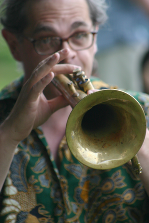
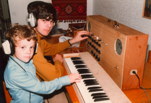
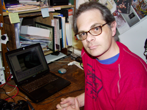
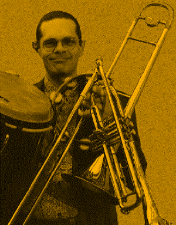
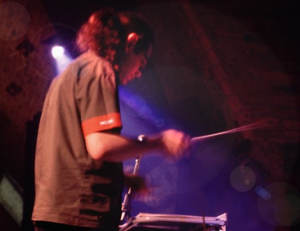
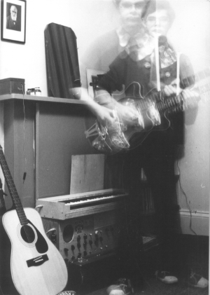

 

  

### Composer

One time, as a young child, we visited a family who had a grand piano in their living room. I remember spending a joyful afternoon rumbling and plinking away, conjuring up thunderstorms, sunshine, and rain on this wonderful piece of sonic furniture.

I’ve always been a composer: or at any rate, a creator of music. At university I made up ragtime tunes on the guitar and bass lines on the synthesiser I built. In my days as a gigging jazz/pop/reggae trumpet player, I was the guy who came up with the horn charts and wrote them out. At Napier university, I became a joint first study in trumpet and composition, and came away with an LLCM in both disciplines.

Over the years I have created something over a hundred original works, a good proportion of which are documented on this website. My current compositional interests include:

- large-scale score-based and/or devised contemporary-classical works, continuing an investigation into music-as-theatre/music-as-performance which was at the heart of my PhD research
- writing music for and with the Javanese gamelan, often incorporation performative and/or video elements
- creating music through the medium of livecoding in SuperCollider

### Teacher

I hold a permanent post as Head of the masters programmes in music at the Royal Conservatoire of Scotland, where I also coordinate the conducting department and various gamelan-related activities. I teach a range of subjects at both undergraduate and masters level, addressing such areas as interdisciplinary collaboration, musics of the world, and contextual studies.

In 2011 I completed a PhD at the University of St Andrews under the auspices of the Conservatoire, with a thesis entitled ‘Music as theatre, music as performance: six new works’.

Between 1993 and 2012, I taught at Stevenson College Edinburgh (now Edinburgh College). I specialised in composition and music technology, but also from time to time covered theory, aural, improvisation, sound recording, harmony, history and performance. In my capacity as part of the delivery team for their BA (Hons) in Music Performance, I also held a nominal post as an Associate Lecturer at Abertay University.

### Performer

Between 1998 and 2002 I worked mainly as a freelance trumpet player, also playing trombone, didgeridu, guitar, and world percussion. I did session and gigging work with a wide variety of pop, jazz and world groups, including Salsa Celtica, Tartan Amoebas, Eliza Carthy and Brian McNeil, appearing at numerous major venues and festivals, UK and worldwide. During this period I also worked as a performer/actor/musician with a number of theatre companies, including Communicado, Northern Stage, IOU Theatre and Forced Entertainment.

For a number of years my performing activity lapsed, with the exception of appearances with the Glasgow gamelan group Naga Mas, and occasional guerilla activity with my street-band-gone-wrong The Society for High Art Music. Over the last year or so I have taken a renewed interest in devised and improvised performance, working variously with trumpet, voice, gamelan, video, junk-instruments and livecoding.

### Around the web

- tedthetrumpet@gmail.com – send me an email
- [post.lurk.org/@tedthetrumpet](https://post.lurk.org/@tedthetrumpet "twitter.com/tedthetrumpet") – updates on Mastodon
- [youtube.com/tedthetrumpet](http://youtube.com/tedthetrumpet "youtube.com/tedthetrumpet") – video documentation and experiments
- [soundcloud.com/tedthetrumpet](http://soundcloud.com/tedthetrumpet "http://soundcloud.com/tedthetrumpet") – audio explorations
- [facebook.com/tedthetrumpet](http://facebook.com/tedthetrumpet "facebook.com/tedthetrumpet") – not active on fb
- [rcs.academia.edu/JSimonvanderWalt](http://rcs.academia.edu/JSimonvanderWalt "rsamd.academia.edu/JSimonvanderWalt") – not very active
- [zotero.org/tedthetrumpet](http://zotero.org/tedthetrumpet "zotero.org/tedthetrumpet") – references and bibliographies
- [uk.linkedin.com/in/tedthetrumpet](http://uk.linkedin.com/in/tedthetrumpet "uk.linkedin.com/in/tedthetrumpet") – token presence
- [vimeo.com/tedthetrumpet](http://vimeo.com/tedthetrumpet "vimeo.com/tedthetrumpet") – some creative work
- [visualcv.com/jsimonvanderwalt](http://www.visualcv.com/jsimonvanderwalt "visualcv.com/jsimonvanderwalt") – my CV

  

        Playing Gamelunk with Naga Mas
        
        Homebrew synth, early 80s
        
        The pismo years
        
        Gigging guy 
        Conducting _invention ensemble_
        
        At uni, late 70s
        
        
        

 

